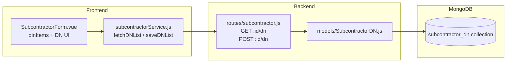

## Permintaan User

Menambahkan section Form DN (Delivery Note) ke halaman form Input dan Edit Subcontractor, identik dengan DN section yang sudah ada di halaman Sales Cost.

## Product Overview

DN section di form Subcontractor adalah fitur pengelolaan daftar Delivery Note secara independen per transaksi subcontractor. Data DN disimpan di koleksi MongoDB terpisah (`subcontractor_dn`), tidak terkait dengan Sales Cost. Fitur ini mencakup semua 8 field DN yang sama dengan Sales Cost, dan data diinput secara manual oleh user.

## Core Features

- Tampilkan section DN di form Input Subcontractor: add/remove row, input semua field (No DN, Pickup, Drop, Qty, PKG, GW, No Container, No Aju, Remarks) dengan komponen `AddressAutocomplete` untuk field Pickup dan Drop
- Tampilkan section DN yang sama di form Edit Subcontractor: pre-fill data DN yang sudah tersimpan saat halaman dibuka
- Backend: MongoDB model `SubcontractorDN` baru, endpoint GET dan POST/PUT untuk fetch & save DN list per subcontractor ID
- Frontend service: tambah `fetchDNList` dan `saveDNList` di `subcontractorService.js`, dipanggil bersamaan saat save transaksi subcontractor

## Tech Stack

- **Backend**: Node.js + Express + Mongoose (sesuai pola `SalesCostDN` yang sudah ada)
- **Frontend**: Vue 3 + Tailwind CSS, komponen `AddressAutocomplete` dan `SubcontractorForm.vue` yang sudah ada

## Implementation Approach

Mengikuti pola yang sudah ada di `SalesCostDN` + `salesCostService.js` secara konsisten:

1. Buat MongoDB model `SubcontractorDN` yang identik strukturnya dengan `SalesCostDN`, hanya ganti `salesCostId` → `subcontractorId`
2. Tambah dua route di `node_backend/routes/subcontractor.js`: `GET /:id/dn` dan `POST /:id/dn` (upsert pattern dengan `findOneAndUpdate + upsert: true`)
3. Tambah `fetchDNList(id)` dan `saveDNList(id, items)` di `subcontractorService.js` mengikuti pola `salesCostService.js` baris 82–90
4. Di `SubcontractorForm.vue`: tambah reactive `dnItems` array, DN section UI (copy struktur dari `SalesCostForm.vue`), panggil `fetchDNList` saat `loadData` (mode edit), dan `saveDNList` setelah main form berhasil disimpan di `handleSubmit`

**Keputusan kritis**: DN disimpan terpisah via upsert setelah main transaction sukses — jika DN gagal disimpan, main data tetap tersimpan dan error ditampilkan sebagai warning (non-blocking), konsisten dengan pola Sales Cost.

## Implementation Notes

- Gunakan `findOneAndUpdate({ subcontractorId }, { $set: { items } }, { upsert: true, new: true })` — persis sama dengan pola SalesCostDN
- Field `pkg` pakai enum yang sama: `["IBC", "CTN", "PIL", "DRM", "", null]`
- `AddressAutocomplete` di DN section harus tetap bisa diakses meski `fieldset :disabled="isDisabled"` aktif — pastikan DN section berada di dalam fieldset yang sama
- Saat mode Input (bukan Edit), `dnItems` diinisialisasi sebagai array kosong `[]`; saat Edit, di-fetch dari `GET /:id/dn`
- Tidak perlu mengubah struktur MySQL subcontractor — DN murni di MongoDB

## Architecture Design



## Directory Structure

```
node_backend/
├── models/
│   └── SubcontractorDN.js          # [NEW] Mongoose model identik dengan SalesCostDN.js, field subcontractorId + items[]
├── routes/
│   └── subcontractor.js            # [MODIFY] Tambah GET /:id/dn dan POST /:id/dn di bagian bawah file

tailadmin-vuejs-1.0.0/src/
├── services/
│   └── subcontractorService.js     # [MODIFY] Tambah fetchDNList(id) dan saveDNList(id, items) mengikuti pola salesCostService.js
└── components/
    └── subcontractor/
        └── SubcontractorForm.vue   # [MODIFY] Tambah dnItems state, DN section UI, integrasi fetch/save di loadData & handleSubmit
```

## Key Code Structures

```js
// node_backend/models/SubcontractorDN.js
const subcontractorDNSchema = new mongoose.Schema(
  {
    subcontractorId: { type: Number, required: true, unique: true, index: true },
    items: [dnItemSchema], // identik dengan SalesCostDN dnItemSchema
  },
  { timestamps: true, collection: "subcontractor_dn" }
);
```

```js
// subcontractorService.js — method signatures baru
async fetchDNList(id)   // GET /api/subcontractor/:id/dn  → { items: [] }
async saveDNList(id, items) // POST /api/subcontractor/:id/dn  body: { items }
```