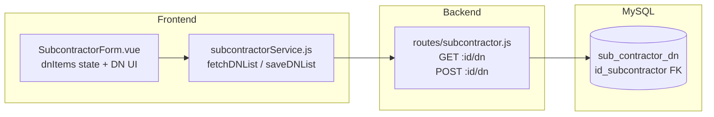

## Permintaan User

Menambahkan section Form DN (Delivery Note) ke halaman form Input dan Edit Subcontractor, identik dengan DN section yang sudah ada di halaman Sales Cost.

## Product Overview

DN section di form Subcontractor memungkinkan user menginput daftar Delivery Note secara manual per transaksi subcontractor. Data DN disimpan di tabel MySQL baru `sub_contractor_dn`, terpisah dari tabel Sales Cost DN. Fitur ini konsisten dengan pola child table yang sudah dipakai di project ini (`sub_contractor_step_schedule`).

## Core Features

- Tambah section DN di form Input Subcontractor: tambah/hapus row, input semua field (No DN, Pickup Alamat, Drop Alamat, Qty, PKG, GW, No Container, No Aju, Remarks) dengan komponen `AddressAutocomplete` untuk field Pickup dan Drop
- Tampilkan section DN yang sama di form Edit Subcontractor: pre-fill data DN yang sudah tersimpan saat halaman dibuka
- Backend: tabel MySQL `sub_contractor_dn` baru, endpoint `GET /:id/dn` dan `POST /:id/dn` di route subcontractor yang sudah ada
- Frontend service: tambah `fetchDNList` dan `saveDNList` di `subcontractorService.js`; DN disimpan setelah main form sukses disimpan (non-blocking — jika DN gagal, main data tetap tersimpan dan ditampilkan sebagai warning)

## Tech Stack

Seluruh implementasi menggunakan stack yang sudah ada di project:

- **Backend**: Node.js + Express + MySQL (`require("../db")`, pola `conn.beginTransaction()`)
- **Frontend**: Vue 3 + Tailwind CSS, komponen `AddressAutocomplete` dan `SubcontractorForm.vue` yang sudah ada

## Implementation Approach

Mengikuti pola **DELETE + re-INSERT** yang sudah dipakai di `replaceStopsForSubcontractor` (baris 163–183 di `subcontractor.js`). Saat save DN, DELETE semua baris `WHERE id_subcontractor = ?` lalu re-INSERT tiap item. Pendekatan ini sederhana, atomic dalam satu koneksi, dan konsisten dengan arsitektur yang ada. Tidak dipakai di dalam `beginTransaction` main form — DN disimpan via endpoint terpisah setelah main form berhasil (non-blocking), mengikuti pola Sales Cost.

## Implementation Notes

- `GET /:id/dn` mengembalikan `rows` langsung dari query MySQL, tidak perlu wrapper tambahan
- `POST /:id/dn` menggunakan `db.getConnection()` + manual `DELETE` + loop `INSERT`, sama persis dengan `replaceStopsForSubcontractor` — tidak perlu `beginTransaction` karena hanya satu tabel
- Field `pkg` menggunakan `ENUM('IBC','CTN','PIL','DRM','')` agar konsisten dengan Sales Cost
- Frontend: `dnItems` diinisialisasi `[]` untuk mode Input; pada mode Edit, `fetchDNList` dipanggil bersamaan dengan `loadData` (paralel, tidak serial)
- `AddressAutocomplete` di DN section harus berada dalam `fieldset` yang sama dengan form utama — pastikan `:disabled="isDisabled"` tetap berlaku
- Error saat save DN ditampilkan sebagai toast warning, bukan error blocking

## Architecture Design



## Directory Structure

```
node_backend/
├── db/
│   └── schema.sql                  # [MODIFY] Tambah CREATE TABLE sub_contractor_dn di bawah definisi sub_contractor
└── routes/
    └── subcontractor.js            # [MODIFY] Tambah helper replaceDNForSubcontractor, route GET /:id/dn dan POST /:id/dn

tailadmin-vuejs-1.0.0/src/
├── services/
│   └── subcontractorService.js     # [MODIFY] Tambah fetchDNList(id) dan saveDNList(id, items) mengikuti pola salesCostService
└── components/
    └── subcontractor/
        └── SubcontractorForm.vue   # [MODIFY] Tambah dnItems reactive state, DN section UI (identik SalesCostForm), panggil fetchDNList di loadData dan saveDNList di handleSubmit
```

## Key Code Structures

```sql
-- sub_contractor_dn (tambah ke schema.sql)
CREATE TABLE `sub_contractor_dn` (
  `id` int(13) NOT NULL AUTO_INCREMENT,
  `id_subcontractor` int(13) NOT NULL,
  `no_dn` varchar(100) NOT NULL DEFAULT '',
  `pickup_alamat` text NOT NULL,
  `drop_alamat` text NOT NULL,
  `qty` int(11) NOT NULL DEFAULT 0,
  `pkg` ENUM('IBC','CTN','PIL','DRM','') NOT NULL DEFAULT '',
  `gw` decimal(10,2) NOT NULL DEFAULT 0,
  `no_container` varchar(100) NOT NULL DEFAULT '',
  `no_aju` varchar(100) NOT NULL DEFAULT '',
  `remarks` text NOT NULL,
  PRIMARY KEY (`id`),
  KEY `idx_id_subcontractor` (`id_subcontractor`)
) ENGINE=InnoDB DEFAULT CHARSET=latin1;
```